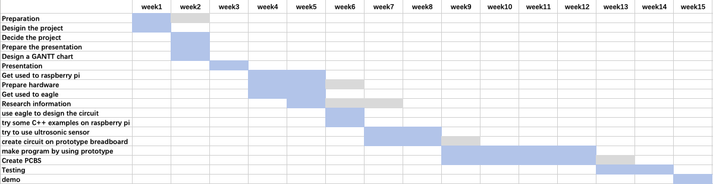

# Mopping Robot
     

# Introduction
Today, smart home has become the trend of the times. The emergence of smart homes has not only changed people's lifestyles, but also greatly improved working efficiency and people's happiness. Therefore, this project has established a mopping robot based on the Raspberry Pi. The group used an ultrsonic sensor HC-SR04 [[1]](https://github.com/tongpozhang/MoppingRobot/wiki/Reference).    
There are two working modes for the mopping robot: manual mode and automatic mode. There is an interface which enables users to choose a mode. The automatic mode makes the mopping robot be able to avoid obstacles automatically. The obstacles are located by an algorithm, and the path when the floor is mopped is random, covering as much as possible to all areas (the area may be cleaned repeatedly). The other mode is the manual control mode. In this mode, the user can control the advancement by pushing buttons on the GUI interface which are forward, backward, left turn, right turn and stop.      
The desigined mopping robot aims at not only freeing people's hands, but also making people's lives more convenient.       

# Content
Click here to see our [content page](https://github.com/tongpozhang/MoppingRobot/wiki).

# GANTT Chart

# Social Media Links(Push the Pictures)
  
 
 

# Watch Our Demo(https://youtu.be/cJLBOQk4zdc)

# Future Work
In the future, we hope to find more efficient algorithms to implement the functions of mopping robots. Save time and improve efficiency by optimizing algorithms and path selection. And, we also hope to optimize the appearance of the mopping robot to attract more users.   

# Team Members
Tongpo Zhang 
Xiaowan Li 
Haobo An 

